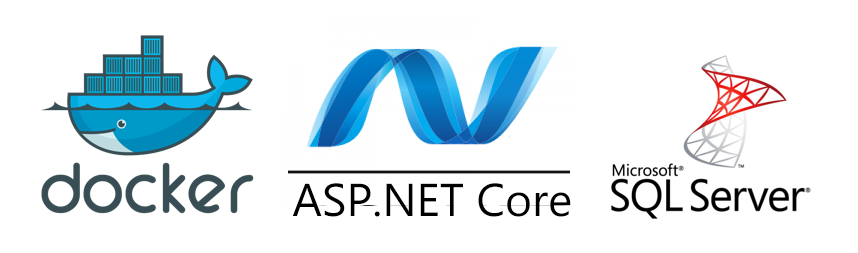
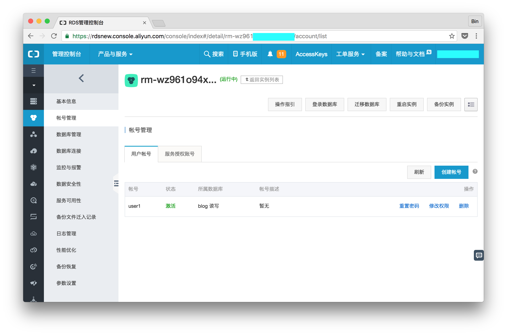
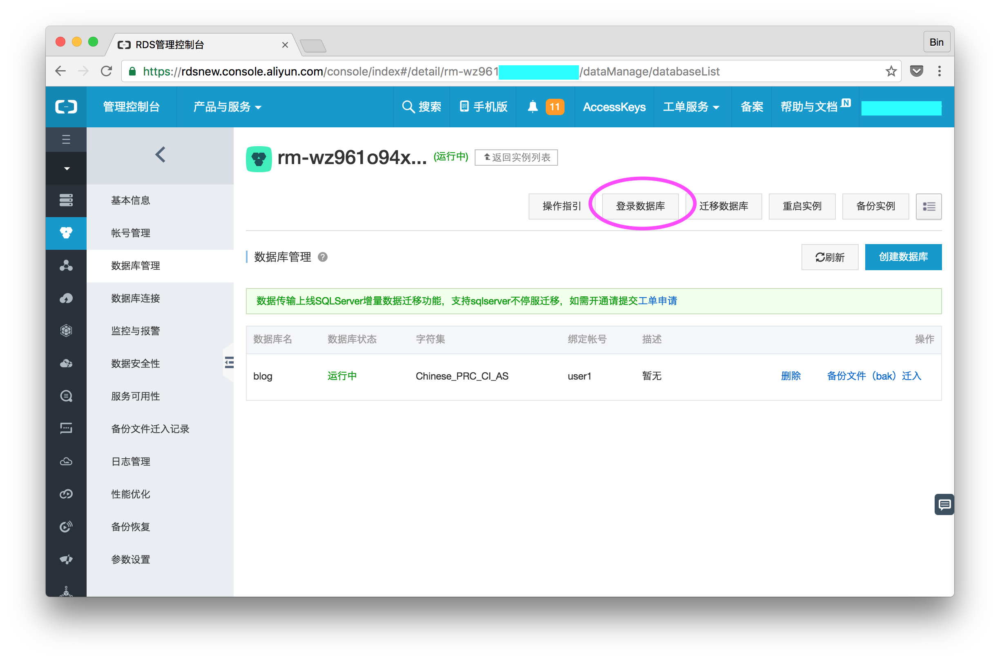
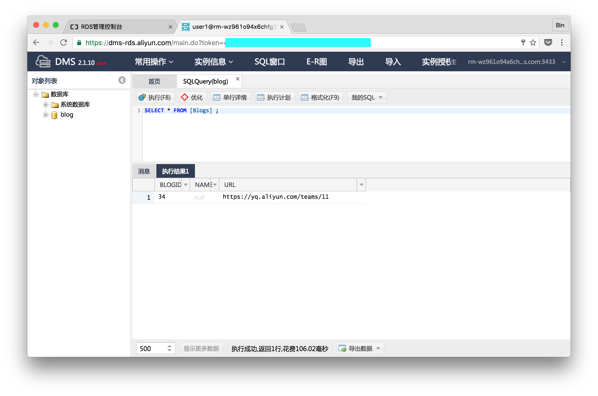
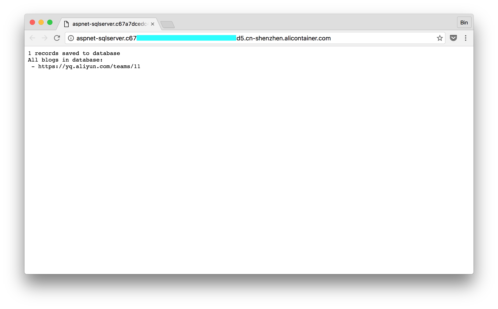

# 在Docker中运行SQLServer ASP.NET应用



云栖社区的文章[在阿里云上运行ASP.NET Docker应用](https://yq.aliyun.com/articles/57712)一文和大家探讨了如何在Docker中运行ASP.NET应用。本文是上一篇文章的续篇，讨论如何让应用访问SQLServer数据库。


## 创建SQLServer数据库

我们首先在阿里云上开通一个SQLServer服务器实例，创建用户```user1```。



创建一个名为Blog的数据库，并授权user1能够访问数据库。为数据库开通外网访问，获得数据库外网访问地址。



所有这些操作都能够在控制台完成，如果你想进入SQLServer的控制台，可以点击上图的```登录数据库```进入数据库的访问界面：



上图显示的内容示例程序运行完成后的结果，现在不用手工创建数据库表，我们会利用Entity Framework的数据库Migration功能初始化数据库。

至此你应当有如下数据库访问信息，记录下这些信息以备下文的程序使用。

- 数据库地址
- 端口号
- 用户名
- 密码


## 引入ORM框架Entity Framework

Entity Framework是.NET上的ORM框架，支持多种常见数据库，包括MS SQL Server、SQLite、Postgres等。详细信息请访问官方博客：[Announcing Entity Framework Core 1.0](https://blogs.msdn.microsoft.com/dotnet/2016/06/27/entity-framework-core-1-0-0-available/)。

我们在```project.json```中引入Entity Framework和SQLServer。


```json
"dependencies": {
"Microsoft.EntityFrameworkCore.Sqlite": "1.0.0",
"Microsoft.EntityFrameworkCore.Design": {
  "version": "1.0.0-preview2-final",
  "type": "build" 
},
"Microsoft.EntityFrameworkCore.SqlServer": "1.0.0",
"Microsoft.EntityFrameworkCore.SqlServer.Design": "1.0.0"
},
```
还有这一段：

```json
"tools": {
"Microsoft.EntityFrameworkCore.Tools": "1.0.0-preview2-final" 
} 
```

执行restore命令加载所有依赖包和工具。

```
dotnet restore
```

命令完成后创建```project.lock.json```文件，不要手工更改这个文件，每次引入新的依赖后请再次执行Restore命令。

## 数据模型和数据库连接

Entity Framework通过DbContext定义对数据库的访问以及对象和数据库的关系映射。我们首先创建一个新C#文件，命名为Model.cs。

在Model.cs中创建一个类BloggingContext继承自DbContext。

```csharp
public class BloggingContext : DbContext
{
    public DbSet<Blog> Blogs { get; set; }
    public DbSet<Post> Posts { get; set; }

    protected override void OnConfiguring(DbContextOptionsBuilder optionsBuilder)
    {
        var serverAddress = Environment.GetEnvironmentVariable("SQLSERVER_ADDRESS");
        var serverPort = Environment.GetEnvironmentVariable("SQLSERVER_PORT");
        var userName = Environment.GetEnvironmentVariable("SQLSERVER_USERNAME");
        var password = Environment.GetEnvironmentVariable("SQLSERVER_PASSWORD");

        var connection = string.Format("Server={0},{1};Database=blog;User Id={2};Password={3};",
        serverAddress,serverPort,userName,password);
        optionsBuilder.UseSqlServer(connection);
    }
}
```


在```OnConfiguring```方法里定义如何访问数据库。从环境变量中读取值构建connection字符串，然后调用optionsBuilder的UseSqlServer方法建立和数据库的连接。如何想要访问其他类型的数据库，例如sqlite，调用optionsBuilder的相应方法即可。


```csharp
var connection = string.Format("Server={0},{1};Database=blog;User Id={2};Password={3};",
    serverAddress,serverPort,userName,password);
optionsBuilder.UseSqlServer(connection);
```

我们的示例中定义两个类，分别是博客Blog和帖子Post，在数据库中是两个不同的数据库表。每个类都只定义了属性和get／set方法。随后我们会利用Entity Framework初始化数据库。

```csharp
public class Blog
{
    public int BlogId { get; set; }
    public string Url { get; set; }
    public string Name { get; set; }

    public List<Post> Posts { get; set; }
}

public class Post
{
    public int PostId { get; set; }
    public string Title { get; set; }
    public string Content { get; set; }

    public int BlogId { get; set; }
    public Blog Blog { get; set; }
}
```

## 访问数据库的代码

更改Startup.cs，加入对数据库的访问。把Startup.cs中的这一段替换：

```csharp
return context.Response.WriteAsync("Hello from ASP.NET Core!");
```

替换的内容为：

```csharp
using (var db = new BloggingContext())
{
    var result = "";
    db.Blogs.Add(new Blog { Url = "https://yq.aliyun.com/teams/11" });
    var count = db.SaveChanges();
    result += string.Format("{0} records saved to database\n", count);

    result += string.Format("All blogs in database:\n");
    foreach (var blog in db.Blogs)
    {
        result += string.Format(" - {0}\n", blog.Url);
    }                
    return context.Response.WriteAsync(result);
}

```
这段代码的作用是在通过创建一个Blog对象在数据库中插入一行，然后从数据库中读取并显示。

## 利用Entity Framework初始化数据库

运行Entity Framework工具创建一个数据库迁移脚本，并初始化数据库。

```
dotnet ef migrations add MyFirstMigration
dotnet ef database update
```

登陆到数据库中可以看到新创建的两个表```Blog```和```Post```。

## 运行

所有代码就绪后即可运行应用观察效果：

```
$ dotnet run
$ curl http://localhost:5000/
1 records saved to database
All blogs in database:
 - https://yq.aliyun.com/teams/11
```

从输出可以看到，我们的程序成功地写入数据库一条数据，然后读取数据库中的所有内容。

## 容器化

Dockerfile内容和helloword的Dockerfile内容一样，抄录在此。

```
FROM microsoft/dotnet:latest
COPY bin/release/netcoreapp1.0/publish/ /app/
EXPOSE 5000/tcp
ENTRYPOINT dotnet /app/aspnet-sqlserver.dll
```

创建docker-compose.yml，用于在本地Docker环境中运行：

```
version: "2"
services:
  aspnet-helloworld:
    image: registry.cn-hangzhou.aliyuncs.com/jingshanlb/aspnet-sqlserver
    environment:
      - SQLSERVER_ADDRESS=
      - SQLSERVER_PORT=
      - SQLSERVER_USERNAME=
      - SQLSERVER_PASSWORD=
    ports:
      - 5000:5000

```

填入相应的环境变量值，分别是数据库地址、端口号、用户名和密码，运行docker compose命令启动容器。

```
$ docker-compose up -d
```
用同样的方式curl访问本机5000端口，可以看到在容器中也运行正常。

## 部署到阿里云容器服务上

部署到阿里云上的模版内容和在本机的文件基本一致，但是有几个小的变化：

- 利用变量名输入数据库的地址、端口、用户和密码
- 不用将容器映射到主机500端口，利用容器服务的路由服务能力
- 指定该服务启动两个容器

这是docker-compose-acs.yml内容：

```
version: "2"
services:
  aspnet-helloworld:
    image: registry.cn-hangzhou.aliyuncs.com/jingshanlb/aspnet-sqlserver
    environment:
      - SQLSERVER_ADDRESS=${SQLSERVER_ADDRESS}
      - SQLSERVER_PORT=${SQLSERVER_PORT}
      - SQLSERVER_USERNAME=${SQLSERVER_USERNAME}
      - SQLSERVER_PASSWORD=${SQLSERVER_PASSWORD}
    labels:
      aliyun.scale: '2'
      aliyun.routing.port_5000: http://aspnet-sqlserver
```

利用模版部署后，访问服务端点URL，可以看到如下输出：



## 讨论和总结

本文介绍了如何在Docker中运行.NET程序并访问SQL Server云数据库，利用ORM框架Entity Framework Core，我们可以很容易地对数据库进行初始化和Migration。

.NET Core应用容器化上云后可以利用阿里云容器服务的丰富功能。容器服务不但支持docker-compose模板提供的容器功能，使得本地开发的Docker镜像和编排模板可以轻松上云；更提供了灵活的部署约束描述，使得对分布式应用的部署和控制变得非常方便。

想了解更多容器服务内容，请访问 [https://www.aliyun.com/product/containerservice](https://www.aliyun.com/product/containerservice)。


